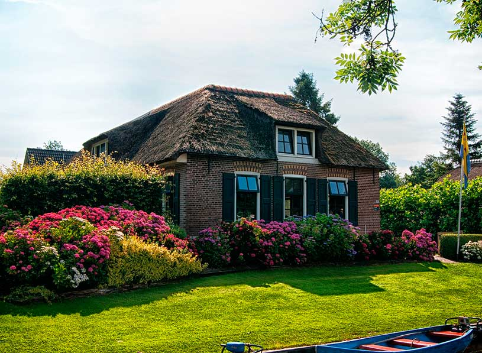

# Sitio Web | Arquitectura

## Introduction
- This project was carried out with help of Juan de la Torre´s Course, it is a simple page about an architecture site.

## Style Guide
### Colors
- blanco: #FFFFFF;
- negro: #111111;
- gris: #343A40;

### Fonts 
- "Raleway"

## Images

## SVG
